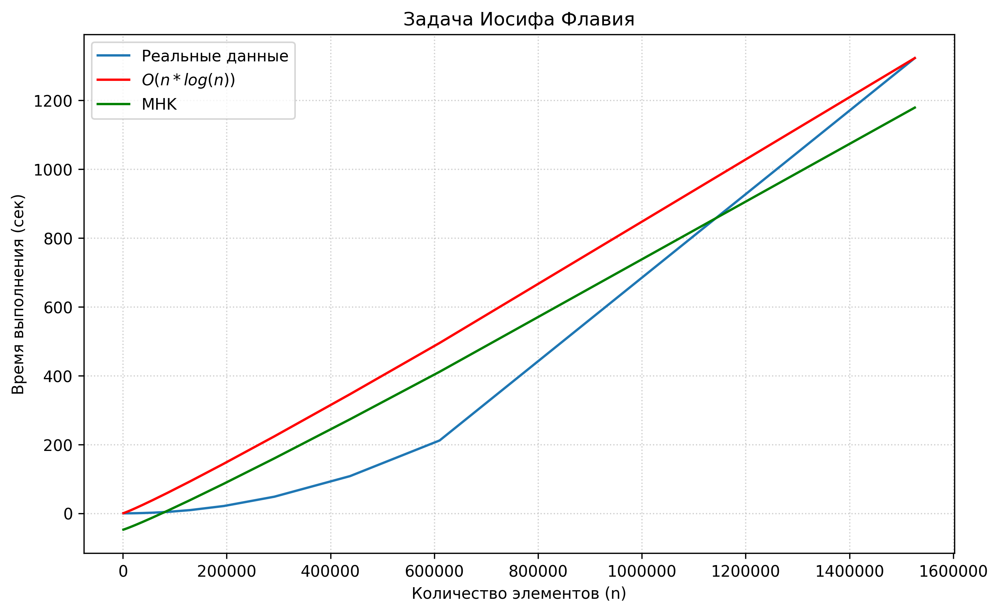

# Анализ временной сложности алгоритма (Задача Иосифа Флавия)

Этот отчет содержит визуализацию и математическое обоснование временной сложности реализованного алгоритма для решения задачи Иосифа Флавия.

## Результаты измерений

### Описание графиков:
*   **Синяя линия (Реальные данные):** Время выполнения программы, измеренное в секундах, в зависимости от количества элементов $n$.
*   **Красная линия ($O(n \log n)$):** Теоретическая кривая сложности $n \log n$, масштабированная под экспериментальные данные.
*   **Зеленая линия (МНК):** Линейная по методу наименьших квадратов.
