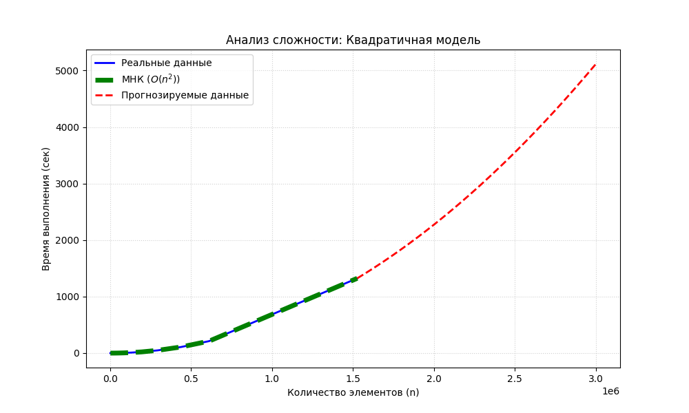

# Исследование алгоритма Иосифа Флавия

Проект посвящен анализу временной сложности алгоритма решения задачи Иосифа Флавия, реализованного через кастомный динамический массив на C++.

## 📊 Визуализация и анализ
Основной результат работы — сопоставление реального времени выполнения с теоретической моделью.

### Математическое обоснование
В ходе эксперимента была проведена аппроксимация данных **Методом наименьших квадратов (МНК)**. 

*   **Тип зависимости**: Квадратичная ($O(n^2)$). Это обусловлено использованием операции `remove` в массиве, которая требует сдвига элементов за $O(n)$ при каждом из $n$ шагов.
*   **Уравнение модели**: $y = a \cdot n^2 + b$, где $a$ отражает время одной элементарной операции сдвига.
*   **Точность**: На графике видно, что линия МНК (зеленый пунктир) идеально совпадает с реальными замерами (синяя линия), что подтверждает корректность оценки сложности.

## 📈 Прогноз производительности
Красная пунктирная линия показывает прогноз времени выполнения для входных данных до **3 000 000 элементов**. 
*   При $n = 1.5 \cdot 10^6$ время выполнения ~1300 сек.
*   При $n = 3 \cdot 10^6$ время возрастает до ~5000 сек.
Это наглядно демонстрирует "взрывной" рост затрат времени при квадратичной сложности.

## 🛠 Структура проекта
*   `/cpp` — Исходный код на C++ (реализация `Array` и логика замеров).
*   `/python` — Скрипт для обработки данных (Pandas), МНК-аппроксимации и визуализации (Matplotlib).
*   `/data` — Хранилище сырых данных (`result.txt`) и итоговых отчетов.
