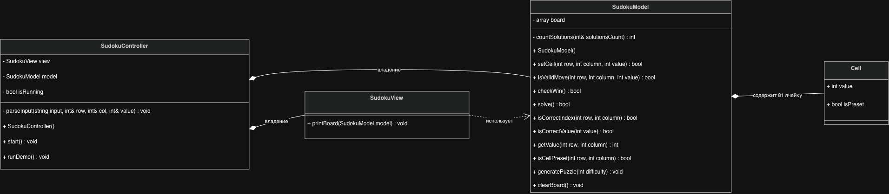
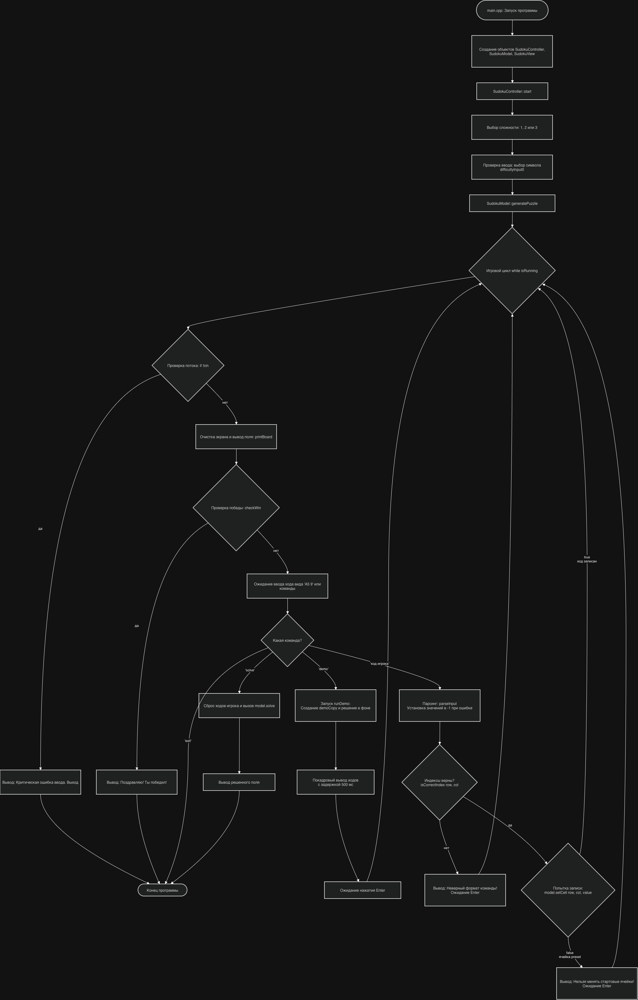

# Игра «Судоку»

Консольная реализация классической игры Судоку на С++, поддерживается случайная генерация полей трех уровней сложности и автоматическое решение

---

## Модель объектно-ориентированного проектирования



*На диаграмме показаны классы `SudokuController`, `SudokuView`, `SudokuModel`, структура `Cell` и связи между ними*

---

## Функциональная схема алгоритма



*Схема отражает основную часть: выбор уровня сложности, генерацию игрового поля, главный игровой цикл, парсинг ввода, обработку команд завершения или авторешения.*

---

## Архитектура

### Разделение слоев (MVC)
Проект строго разделен на три независимых компонента:
* **Model:** Класс `SudokuModel` и структура `Cell`. Хранят состояние матрицы $9 \times 9$, содержат логику игры (проверки правил, генерацию, решение), полностью изолированы от ввода-вывода
* **View:** Класс `SudokuView`. Отвечает только за графическое форматирование, запрашивает данные у модели и рисует сетку
* **Controller:** Класс `SudokuController`. Модуль верхнего уровня, управляет жизненным циклом, обрабатывает и координирует работу Модели и View.

---

## Краткое описание методов классов

### Класс `SudokuModel`

Управляет состоянием игрового поля, проверяет правила Судоку и реализует алгоритм решения

#### Ходы и проверки

| Метод | Описание |
|-------|----------|
| `setCell(int row, int col, int value)` | Записывает цифру в ячейку, если она не является `isPreset`. Возвращает `true` при успешной записи |
| `isValidMove(int row, int col, int value) const` | Проверяет ход по правилам Судоку: отсутствие повторов в строке, столбце и малом квадрате $3 \times 3$ |
| `isCorrectIndex(int row, int col) const` | Защитный метод. Проверяет, лежат ли индексы в пределах от 0 до 8 |
| `isCorrectValue(int value) const` | Проверяет, входит ли устанавливаемое число в диапазон от 1 до 9 |

#### Генерация и решение

| Метод | Описание                                                                                                               |
|-------|------------------------------------------------------------------------------------------------------------------------|
| `generatePuzzle(int difficulty)` | Генерирует игровое поле, оставляя заданное количество пустых лунок (30, 40 или 50). Гарантирует единственность решения |
| `solve()` | Запускает рекурсивный алгоритм для автоматического решения Судоку. Возвращает `true`, если решение найдено             |
| `clearBoard()` | Полностью сбрасывает и очищает матрицу поля                                                                            |
| `countSolutions(int& solutionsCount)` | Приватный рекурсивный метод. Считает количество решений для проверки уникальности поля при генерации                   |

#### Состояние игры и геттеры

| Метод | Описание |
|-------|----------|
| `checkWin()` | Проверяет, заполнено ли всё поле корректно и наступила ли победа |
| `getValue(int row, int col) const` | Возвращает число, хранящееся в указанной ячейке поля |
| `isCellPreset(int row, int col) const` | Проверяет, является ли ячейка заблокированной стартовой подсказкой |

---

### Структура `Cell`

Представляет элементарную ячейку игрового поля.

| Поле | Описание |
|------|----------|
| `int value` | Числовое значение в ячейке (0 — если пустая, 1-9 — если заполнена) |
| `bool isPreset` | Флаг стартовой подсказки. Если `true`, число зафиксировано системой и недоступно для изменений |

---

### Класс `SudokuView`

Отвечает за визуальное отображение интерфейса.

| Метод | Описание |
|-------|----------|
| `printBoard(const SudokuModel& model) const` | Считывает данные из Модели и выводит в консоль размеченную псевдографикой сетку Судоку |

---

### Класс `SudokuController`

Управляет ходом игры, обрабатывает ввод пользователя и координирует компоненты.

| Метод | Описание |
|-------|----------|
| `SudokuController()` | Конструктор, устанавливает флаг активности игры `isRunning` в `true` |
| `start()` | Главный движок игры. Отвечает за меню сложности, цикл обновления экрана, обработку команд `exit` / `solve` и обработку ошибок ввода |
| `parseInput(const string& input, int& row, int& col, int& value)` | Безопасно разбирает строку вида "A5 9" на индексы и число. При ошибке выставляет переменным значения `-1` |
| `runDemo()` | Запускает демонстрационный режим: создает копию Модели, решает её в фоне и пошагово с задержкой в 500 мс визуализирует верный ход для каждой пустой ячейки |

---

## Сборка и запуск

### Файлы проекта
* `main.cpp`
* `include/SudokuModel.hpp`, `include/SudokuView.hpp`, `include/SudokuController.hpp`
* `src/SudokuModel.cpp`, `src/SudokuView.cpp`, `src/SudokuController.cpp`
* `Makefile`

### Компиляция и запуск

```bash
# Сборка проекта
make

# Запуск игры
make run

# Очистка объектных файлов
make clean